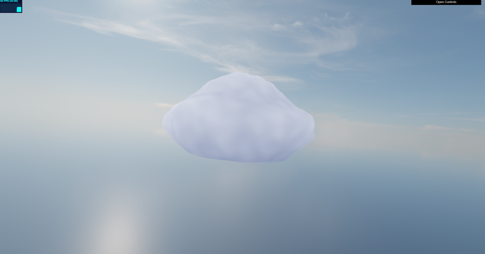
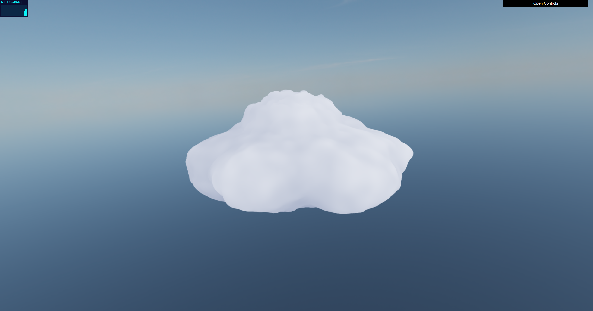
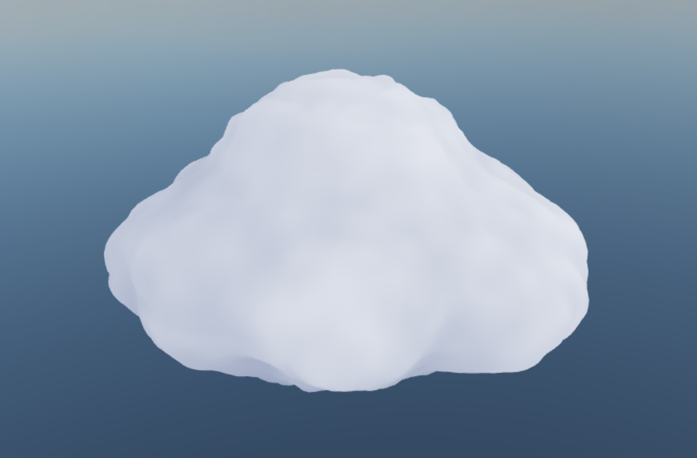

**University of Pennsylvania, CIS 5660: Procedural Graphics,
Homework 1**

* Bryce Joseph
* [Website](https://brycejo.com/), [LinkedIn](https://www.linkedin.com/in/brycejoseph/), [GitHub](https://github.com/brycej217)
* Tested on: Windows 11, Intel(R) CORE(TM) Ultra 9 275HX @ 2.70GHz 32.0GB, NVIDIA GeFORCE RTX 5080 Laptop GPU 16384MB

# CIS 5660 Homework 1 - Cloud Ball

These are some gifs and screenshots of my homework 1.

# Live Demo
Click [this link](https://brycej217.github.io/hw01-fireball/) to be taken to a live demo.

# Custom Vertex Shader
The vertex shader utilizes a low frequency combination of sine waves to have the cloud slowly swell, which is added to an fbm implmentation which sums octaves of Perlin noise to displace verteces along their normal. Vertices closer to the middle of the ball will be displaced by a larger amount according to the puffiness set by the user.

# Custom Fragment Shader
The custom fragment shader also utilizes Perlin noise along with the displacement varying variable to brighten areas that are further from the cloud center, giving them a realistic cloudlike appearance. Thank you to this [article](https://adrianb.io/2014/08/09/perlinnoise.html) for Perlin noise algorithm details.